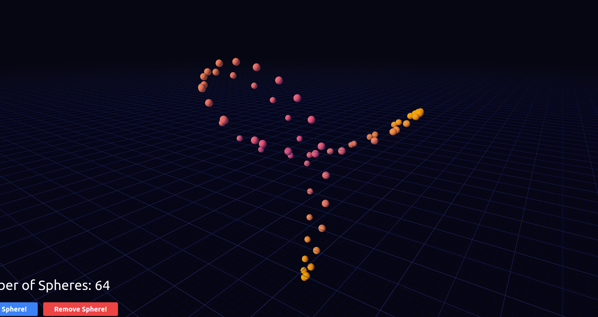

# R3F + Koota Starter

[Live Example](https://codesandbox.io/p/github/Ctrlmonster/r3f-koota-starter/main)

This is a simple **starter example** for how to use [Koota](https://github.com/pmndrs/koota) with react three fiber.

**Koota** is a brand new ecs library by **pmndrs**. Designed for highly dynamic realtime apps (i.e. games).
While the library is mostly finished, expect some small changes to happen.
This example shows how to create a world, a basic systems schedule, spawn entities with Traits (ecs components)
and connecting the simulation back to r3f/three.

## Getting Started
Take a look at [ecs/index.ts](src%2Fjs%2Fecs%2Findex.ts) to see how we create a world and a schedule.
Inside [ecs/traits.ts](src%2Fjs%2Fecs%2Ftraits.ts) you'll see some example traits and
[ecs/systems.ts](src%2Fjs%2Fecs%2Fsystems.ts) will demonstrate some example systems.   

## Check out the [Koota repo](https://github.com/pmndrs/koota) for more docs. ###

 

